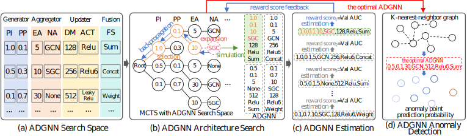

# ADGNAS

- ADGNS can adaptively design a ADGNN with good generalized performance according to distribution difference of K-nearest-neighbor graph for anomaly detection.

- The framework of ADGNAS is as follows:

<br>
<div align=left>  </div>


## Install based on Ubuntu 16.04

- **Ensure you have installed CUDA 11.0 before installing other packages**

**1.Python environment:** recommending using Conda package manager to install

```python
conda create -n adgnas python=3.7
source activate adgnas
```

**2.Python package:**
```python
torch == 1.13.1
torch-geometric == 2.3.0
torch-cluster == 1.6.1
torch-scatter == 2.1.1
torch-sparse == 0.6.17
torch-spline-conv == 1.2.2
```
## Run the Experiment
**1.Performance test with the optimal ADGNN designed by AdaGramp**
```python
run optimal_adgnn_performance_test.py
```

**2.Search new ADGNN from scratch using ADGNAS**
```python
run adgnas.py
```
