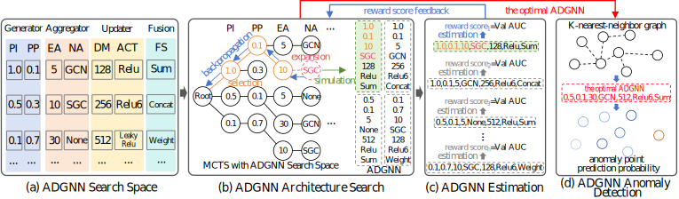

# ADGNAS

- ADGNAS can adaptively design a ADGNN with good generalized performance according to distribution difference of K-nearest-neighbor graph (KNNG) for discrete point anomaly detection.

- The framework of ADGNAS is as follows:

<br>
<div align=left>  </div>


## Install based on Ubuntu 16.04

- **Ensure you have installed CUDA 11.0 before installing other packages**

**1.Python environment:** recommending using Conda package manager to install

```python
conda create -n adgnas python=3.7
source activate adgnas
```

**2.Python package:**
```python
torch == 1.13.1
torch-geometric == 2.3.0
torch-cluster == 1.6.1
torch-scatter == 2.1.1
torch-sparse == 0.6.17
torch-spline-conv == 1.2.2
```
## Run the Experiment
**1.Performance test with the optimal ADGNN designed by ADGNAS.**
```python
run performance_test.py
```

**2.Search for a new ADGNN architecture from scratch using ADGNAS.**
```python
run monte_carlo_tree_search.py 
```

## Citing
If you think ADGNAS is useful tool for you, please cite our paper, thank you for your support:

```
@article{CHEN2026132348,
title = {Attribute-decoupled graph neural architecture search for discrete point anomaly detection},
journal = {Expert Systems with Applications},
volume = {322},
pages = {132348},
year = {2026},
issn = {0957-4174},
doi = {https://doi.org/10.1016/j.eswa.2026.132348},
url = {https://www.sciencedirect.com/science/article/pii/S0957417426012613},
author = {Jiamin Chen and Zhenpeng Wu and Tairan Huang and Xinqiu Zhang and Siyang Xiao and Weihua Ou}
}
```
